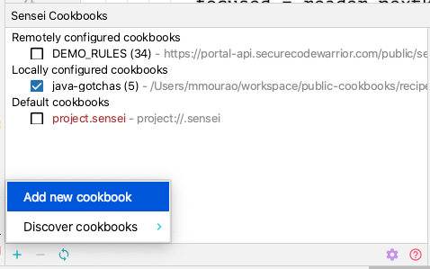

# How to add a cookbook

## Using zip link

If the listing in the index has a `download.zip` link

1. Right click on the "download.zip" link next to the wanted cookbook and copy the linked URL
2. Open up Sensei and add a cookbook  

3. Add cookbook inside sensei using the zip URL as the location and give it a recognizable ID

## From a zip locally

If the listing in the index has a `download.zip` link

1. Download the `.zip` using the "download.zip" link next to the wanted cookbook
2. Unzip the downloaded `.zip` file and move to a local folder located on your local drive
2. Open up Sensei and add a cookbook  

3. Add cookbook inside sensei using the local folder as the location and give it a recognizable ID

## From a Github repo directly

Some of the Cookbooks will be in repositories which support direct use in Sensei. These will be listed in the index with a `use .git` link.

1. Copy the URL linked to
   a. Right click and choose `Copy Link Address`
2. Open up Sensei and add a cookbook  

3. Add cookbook inside sensei using the copied URL as the location and give it a recognizable ID

