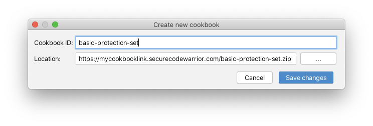

# How to add a cookbook

<!-- Once a first version is only I would use one of those to base these screenshots off of -->

## Using zip

1. Right click on the "Get as zip" link next to the wanted cookbook and copy the target link
2. Open up Sensei and add a cookbook  

3. Add cookbook inside sensei using the zip link as the location and give it a recognizable ID

# How to contribute cookbooks

1. Fork this repository using GitHub
2. Clone the forked repository
3. Open the cookbook inside sensei
    - Add as local cookbook
    - As location use the path of the cookbook you want to contribute to
4. Create a PR on this repository based on the fork
